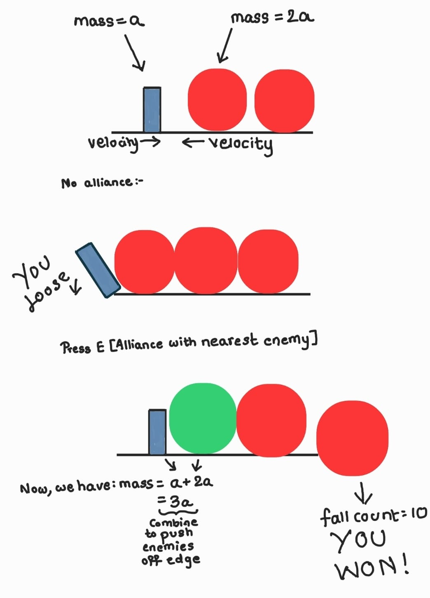

# Rolling Battle

## Team Members

| Name             | Email             | GitHub Username   |
|-----------------|------------------|------------------|
| Aditya Pandiarajan | alnu@usc.edu      | Aditya10CR7       |
| Gaurav Zanpure   | gzanpure@usc.edu   | Gaurav-Zanpure    |
| Jiayuan Fu       | jfu03326@usc.edu   | j2fu              |

---

## Logline

In this fast-paced 2D physics-based platformer, survival hinges on strategy—dodge rolling enemies that threaten to push you off the edge, but flip the battle by converting them into allies, reversing their momentum, and using their combined force to push the remaining threats off the platform before they knock you out.

---

## Genre Research

### Researched Titles:
- **Heave Ho**
- **Badland**
- **Tumbleseed**

### Common Tropes:
- Momentum-based movement requiring precise control due to physics forces.
- Gravity and collision mechanics influencing interactions.
- Knockback effects and environmental hazards increasing difficulty.
- Emphasis on survival and adapting to dynamic environments over precise platforming.
- Use of physics-based interactions to create emergent gameplay challenges.

These elements directly tie into the game's core mechanic—converting enemies into allies to manipulate battlefield momentum and turn the tide in the player's favor.

---

## Twist: Enemy-to-Ally Conversion

Unlike traditional 2D physics-based platformers where enemies are always obstacles, **Rolling Battle** introduces a unique enemy conversion mechanic. Players can select the nearest rolling enemy and convert it into an ally, reversing its direction. This introduces a **strategic element**, requiring players to:
- Time conversions effectively to maximize impact.
- Use allies to counter enemy momentum.
- Plan their positioning to maintain battlefield control.

### Why This is Innovative for a 2D Platformer:
- Shifts gameplay from pure survival to **strategic physics manipulation**.
- Encourages tactical thinking over simple reaction-based gameplay.
- Integrates **momentum, mass, and force** as core mechanics for decision-making.
- Allows for **emergent gameplay**, where player choices actively shape outcomes.

---

## Prototype Description

**Rolling Battle** is a 2D physics-based platformer with a unique enemy-to-ally conversion mechanic. The player's objective is to stay on the platform while avoiding being knocked off by rolling enemies. By converting the nearest enemy into an ally, players can reverse its movement and push back against threats.

### Gameplay Objectives:
- **Survive** as long as possible by avoiding being pushed off.
- **Convert** enemies into allies strategically to counteract threats.
- **Win** by successfully pushing 10 enemies off the platform.

---

## Mechanic Matrices

| Mechanic                  | Description                                              | Interaction with Twist                                      | Affected Genre Elements                                      | Type of Innovation                     |
|---------------------------|----------------------------------------------------------|-------------------------------------------------------------|----------------------------------------------------------------|----------------------------------------|
| **Enemy-to-Ally Conversion** | Convert the nearest rolling enemy into an ally, reversing its movement direction. | Changes avoidance-based survival into a strategic battlefield control mechanic. | - Enemy behavior and physics interactions  <br> - Survival strategy beyond dodging  <br> - Momentum-based movement as a tool | **Core mechanic defining game identity** |

---

## GitHub Repository

**Repository:** [https://github.com/CSCI-526/pair-prototype-group-10]

---

## Individual Contributions

### **Gaurav Zanpure**
- Level Design
- Player and Enemy Mechanics
- Enemy Spawning System
- Enemy-to-Ally Conversion Mechanic
- Knockback and Momentum-Based Interaction
- Game Over and Win Condition Handling
- UI State Management
- Game Restart System
- Physics-Based Movement

### **Aditya Pandiarajan**
- Updating Space Button
- UI improvement
- Documentation
- Discord Marketing
- Player Mechanic

### **Jiayuan Fu**
- Player and Sample Enemy Finite State Machine Implementation
- Player Mechanics and Action Design
- Player Action System Implementation
- Player-Enemy Combat System Design

---

## Diagram/Sketch



---

## How to Run the Project

1. Clone the repository:
   ```sh
   git clone https://github.com/CSCI-526/pair-prototype-group-10
   ```
2. Open the project in Unity.
3. Ensure dependencies are installed (e.g., Unity version, physics settings, etc.).
4. Playtest using the Unity Editor.

---

## Controls

- **Arrow Keys / A & D**: Move left and right
- **E Key**: Convert nearest enemy to an ally

---

## Future Enhancements

- Implement additional enemy types with unique behaviors.
- Introduce different levels with varying difficulty.
- Add multiplayer or cooperative gameplay mechanics.
- Expand physics-based interactions for more emergent gameplay scenarios.

---

## License

[Specify License Here]

---

## Contact
For any questions or contributions, contact:
- **Aditya Pandiarajan** - alnu@usc.edu
- **Gaurav Zanpure** - gzanpure@usc.edu
- **Jiayuan Fu** - jfu03326@usc.edu

